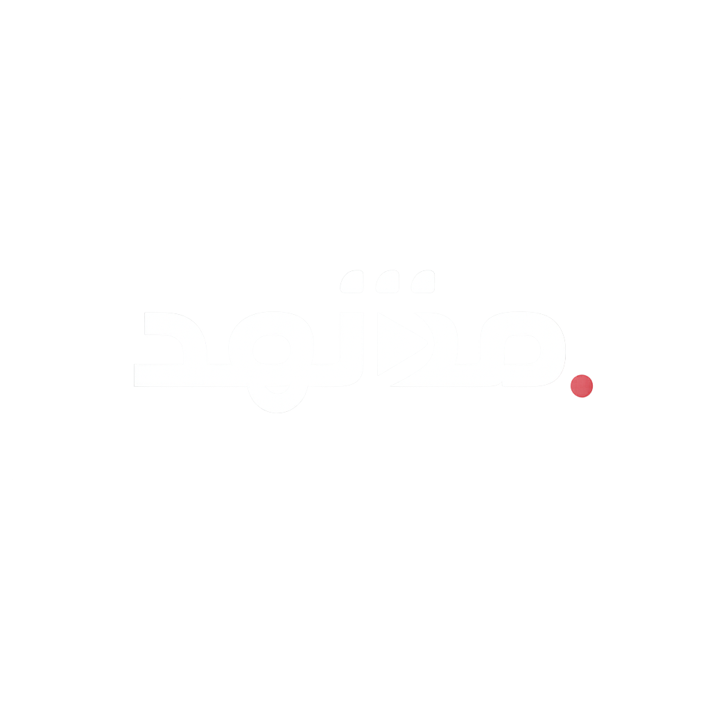

<div align="center">



# مشهد — Mashhad

**Premium Arabic-first streaming aggregation platform**

[](https://nextjs.org)
[](https://typescriptlang.org)
[](https://tailwindcss.com)
[](https://supabase.com)
[](https://mashhad-web.vercel.app)
[](LICENSE)

**[🌐 Live Demo](https://mashhad-web.vercel.app)** &nbsp;·&nbsp; **[📁 Repository](https://github.com/KNIGHTABDO/MASHHAD)** &nbsp;·&nbsp; **[🐛 Report Bug](https://github.com/KNIGHTABDO/MASHHAD/issues)**

</div>

---

> ⚠️ **Mashhad does not host any media content.** It is an aggregation interface only. All movies, series, and metadata are provided through third-party APIs and belong to their respective rights holders.

---

## 📖 Overview

Mashhad is a full-stack Arabic streaming platform that aggregates content from multiple streaming APIs (Real-Debrid, EgyDead, VidSrc, Torrentio), provides intelligent subtitle synchronization from 3 sources (SubDL, OpenSubtitles, Stremio), and delivers a bilingual (Arabic/English) cinematic experience.

### What makes it different?

| Feature | Description |
|---|---|
| 🎬 **Multi-source streaming** | Real-Debrid cached torrents + EgyDead MP4s + VidSrc fallback |
| 🗣 **Smart Arabic subtitles** | 3-source subtitle engine with release-group sync scoring |
| 🌍 **True bilingual** | Arabic ↔ English with RTL/LTR, zero hardcoded strings, server-side re-fetch |
| 📺 **Netflix-grade UX** | Multi-profile, Continue Watching, Skip Intro, Post-playback screen |
| 🔒 **Secure by design** | Clerk Auth + Supabase RLS, API auth guards, SSRF protection |
| 📱 **Fully responsive** | Cinematic landing page, mobile-first UI, GPU-promoted scroll containers |

---

## ✨ Features

### 🎥 Multi-Source Streaming Engine
- **Real-Debrid** — Torrentio → magnet hashes → RD instant availability → unrestrict → direct MKV + HLS
- **EgyDead** — Direct embedded extraction of HLS/MP4 streams from hosters (like Forafile) via JavaScript unpacking
- **VidSrc Embed** — Ad-free fallback embed player with `postMessage` progress tracking
- **Smart Fallback Chain** — Auto-advances: Direct MKV/MP4 → HLS → VidSrc embed on any error
- **Parallel Orchestrator** — All adapters run concurrently with an 8s timeout for fastest resolution
- **Quality Selector** — Users can browse and switch between available stream qualities

### 🗣 Intelligent Subtitle System
- **3-Source Aggregation** — SubDL, OpenSubtitles REST v1, Stremio Legacy v3
- **Lip-Sync Scoring** — Matches subtitle release tags (WEB-DL, NTb, x264…) against the stream's actual filename for perfect frame timing
- **ZIP Extraction** — `fflate` handles SubDL DEFLATE (method 8) compressed archives
- **Format Pipeline** — ASS → SRT → VTT for universal browser `<track>` playback
- **Encoding Detection** — UTF-8, Windows-1256, ISO-8859-1 with Arabic character validation
- **English Fallback** — Automatically searches English subtitles when Arabic is unavailable

### 🌍 Bilingual Support (Arabic / English)
- Instant language switch using `router.refresh()` — no full page reload, no white flash
- TMDB metadata fetched in the active UI language via `mashhad-lang` cookie + `?lang=` param
- RTL/LTR layout adaptation applied to the `<html>` element
- Complete i18n across all pages — zero hardcoded UI strings

### 🌟 Premium Features
- **🤖 Algorithmic Recommendations** — Dynamic "Because you watched..." rows driven by profile watch history + TMDB similarity
- **⬇️ Offline Downloads** — One-click direct MKV/MP4 download with a quality selector dropdown
- **🎌 Anime Section** — Dedicated `/anime` hub aggregating trending, top-rated, and newly released Japanese animation via TMDB
- **🎭 Actor & Director Profiles** — Rich biographies and "Known For" filmographies
- **🔑 Admin Dashboard** — Role-based secure analytics portal
- **🌐 Premium Landing Page** — Scroll-scrubbing cinematic hero (Framer Motion + video sync), real TMDB trending posters with 3D tilt effect, animated stats counters, fully mobile-responsive

### 📺 Smart Playback
- **Continue Watching** — Supabase-synced progress every 5s, survives stream server switches, works for movies & TV episodes
- **Skip Intro / Outro** — IntroDB segment timestamps per episode
- **Auto Next Episode** — Post-playback screen with countdown and availability check
- **Server Switch Spinner** — Visual feedback when changing stream servers mid-playback
- **RAF Progress Bar** — Hover tooltip uses `requestAnimationFrame` + direct DOM writes — zero React re-renders per mousemove
- **Multi-Profile** — Up to 5 independent profiles per account, Netflix-style picker

### 🎨 UI / Performance
- GPU-promoted scroll containers (`translateZ(0)` + `overflow-y: clip`)
- `requestAnimationFrame`-debounced `onScroll` scroll-arrow state (prevents 12 synchronous re-renders per tick)
- `will-change: transform` on card wrappers before hover (pre-promotes GPU layer ahead of `backdrop-filter: blur()`)
- Splash screen initialized as `null` — no 1-frame flash on return visits
- Hero carousel preloads next slide image before transition
- PersonalRows: skeleton cards appear immediately, TMDB content fills staggered

---

## 🛡 Security

| Layer | Implementation |
|---|---|
| **API auth** | `/api/tmdb`, `/api/subtitles/search`, `/api/segments` all require a valid Supabase session |
| **TMDB allowlist** | Proxy only forwards requests to prefixes in `ALLOWED_TMDB_PREFIXES` |
| **SSRF protection** | Subtitle download URL validated against `ALLOWED_SUBTITLE_HOSTS` before any server-side fetch |
| **HTTP headers** | `X-Frame-Options: SAMEORIGIN`, `X-Content-Type-Options: nosniff`, `Referrer-Policy`, `Permissions-Policy`, `X-DNS-Prefetch-Control` |
| **RLS on all tables** | Every policy uses `(SELECT auth.uid())` — evaluated once per query, not per row |
| **Composite DB indexes** | `profiles(user_id)`, `watch_history(profile_id, content_id, content_type)`, `watchlist(profile_id, content_id)` |
| **No tracking cookies** | Only 3 essential cookies: `mashhad-lang`, `active_profile_id`, Supabase session |
| **Token exposure** | Real-Debrid, TMDB, OpenSubtitles, SubDL tokens are server-side only — never in `NEXT_PUBLIC_*` |
| **VidSrc iframe** | No `sandbox` attribute — VidSrc anti-adblock returns 404 if sandboxed |

---

## 🛠 Tech Stack

| Layer | Technology | Version |
|---|---|---|
| Framework | Next.js (App Router) | 15.5 |
| Language | TypeScript (strict) | 5.x |
| React | React | 19.1 |
| Styling | Tailwind CSS | 4.x |
| Animations | Framer Motion | 12.x |
| Database | Supabase (PostgreSQL + RLS) | 2.x |
| Authentication | Clerk (with Supabase JWT Template) | 7.x |
| Server State | TanStack React Query | 5.x |
| Client State | Zustand | 5.x |
| Video | Custom HTML5 Player + HLS.js | 1.6 |
| Subtitles | fflate (zip), custom converters | 0.8 |
| Font | Thmanyah Sans (local woff2) | — |
| Deployment | Vercel (auto-deploy from `main`) | — |

### External APIs

| API | Purpose |
|---|---|
| TMDB | Metadata, search, discover, trending, person profiles |
| Torrentio | Torrent stream hash resolution |
| Real-Debrid | Cached torrent → direct MKV URL + HLS |
| OpenSubtitles REST v1 | Subtitle search & download |
| SubDL | Arabic subtitle search + release metadata (ZIP) |
| Stremio Addons | Legacy subtitle database (fallback) |
| IntroDB | TV episode intro/outro segment timestamps |
| VidSrc | Embed fallback player |

---

## 🚀 Getting Started

### Prerequisites
- Node.js 18+
- npm

### Installation

```bash
git clone https://github.com/KNIGHTABDO/MASHHAD.git
cd MASHHAD
npm install
```

### Environment Variables

Create `.env.local` in the project root:

```env
# Clerk Auth (required)
NEXT_PUBLIC_CLERK_PUBLISHABLE_KEY=your_clerk_pub_key
CLERK_SECRET_KEY=your_clerk_secret_key

# Supabase (required - JWT template mapped from Clerk)
NEXT_PUBLIC_SUPABASE_URL=your_supabase_url
NEXT_PUBLIC_SUPABASE_ANON_KEY=your_supabase_anon_key

# TMDB (required — metadata, search, discover)
TMDB_API_KEY=your_tmdb_api_key

# Real-Debrid (required for stream resolution)
REALDEBRID_API_TOKEN=your_realdebrid_token

# Subtitles (required for full subtitle coverage)
OPENSUBTITLES_API_KEY=your_opensubtitles_rest_api_key
SUBDL_API_KEY=your_subdl_api_key

# App
NEXT_PUBLIC_APP_URL=http://localhost:3000
```

### Run

```bash
npm run dev      # Development — http://localhost:3000
npm run build    # Production build
npm start        # Production server
npm run lint     # Lint
```

---

## 📁 Project Structure

```
mashhad/
├── app/
│   ├── layout.tsx                      # Root layout (font, metadata, Providers)
│   ├── globals.css                     # Design tokens, animations, utilities
│   ├── not-found.tsx                   # 404 page
│   ├── (auth)/                         # Login & Register (outside main layout)
│   │   ├── login/page.tsx
│   │   └── register/page.tsx
│   ├── (landing)/                      # Public landing page (no auth required)
│   │   └── landing/page.tsx            # Cinematic hero + features + real TMDB posters
│   ├── (main)/                         # Main app layout (Navbar + Footer)
│   │   ├── layout.tsx
│   │   ├── page.tsx                    # Home — hero carousel + content rows
│   │   ├── movies/page.tsx             # Movies browse
│   │   ├── series/page.tsx             # Series browse
│   │   ├── anime/page.tsx              # Anime dedicated section
│   │   ├── search/page.tsx             # Bilingual search (language-aware TMDB queries)
│   │   ├── movie/[id]/page.tsx         # Movie detail (poster, synopsis, cast, play)
│   │   ├── series/[id]/page.tsx        # Series detail (seasons, episodes, progress)
│   │   ├── watch/[id]/page.tsx         # Full-screen video player
│   │   ├── profiles/page.tsx           # Netflix-style profile picker
│   │   ├── settings/page.tsx           # User settings
│   │   ├── privacy/page.tsx            # Privacy Policy (bilingual, cookie table)
│   │   ├── terms/page.tsx              # Terms of Service (bilingual, aggregator disclaimer)
│   │   └── contact/page.tsx            # Contact page
│   └── api/
│       ├── tmdb/
│       │   ├── [...path]/route.ts      # TMDB proxy — auth guard + path allowlist + lang-aware
│       │   └── detail/route.ts         # Single item detail — accepts ?lang= query param
│       ├── stream/resolve/route.ts     # Stream resolution engine (parallel adapters)
│       ├── realdebrid/
│       │   └── resolve/route.ts        # Real-Debrid torrent → stream URL
│       ├── subtitles/
│       │   └── search/route.ts         # Multi-source subtitle search — auth guard + SSRF fix
│       ├── segments/route.ts           # IntroDB intro/outro timestamps — auth guard
│       ├── continue-watching/route.ts  # Watch progress API
│       └── watchlist/route.ts          # User saved list API
├── components/
│   ├── Providers.tsx                   # QueryClient + LanguageProvider + SplashScreen
│   ├── content/
│   │   ├── ContentRow.tsx              # RAF-debounced scroll arrows, overflow-y:clip GPU fix
│   │   ├── ContentCard.tsx             # will-change GPU promotion, hover preview card
│   │   ├── HeroSection.tsx             # Auto-carousel, next-slide preload, i18n
│   │   ├── PersonalRows.tsx            # ContinueWatchingRow + MyListRow (skeleton + lang)
│   │   ├── EpisodeList.tsx
│   │   └── WatchlistButton.tsx
│   ├── navigation/
│   │   ├── Navbar.tsx                  # Fixed navbar with search, lang toggle, profile menu
│   │   └── Footer.tsx                  # Footer with legal links + disclaimer
│   ├── player/
│   │   ├── WatchClient.tsx             # Main player (RAF progress bar, server-switch spinner, i18n)
│   │   └── PostPlaybackScreen.tsx      # Next episode screen
│   ├── profiles/                       # Profile picker, editor, avatar
│   ├── subtitles/                      # Subtitle selector UI
│   └── ui/
│       └── SplashScreen.tsx            # null-init state — no 1-frame flash on return visits
├── lib/
│   ├── animations.ts                   # Framer Motion presets (spring, fadeIn, scaleIn, etc.)
│   ├── i18n/
│   │   ├── context.tsx                 # LanguageProvider — uses router.refresh() NOT reload()
│   │   ├── ar.ts                       # Arabic translations (complete, no missing keys)
│   │   └── en.ts                       # English translations (complete, mirrors ar.ts exactly)
│   ├── servers/
│   │   ├── index.ts                    # Parallel orchestrator (8s timeout, auto-fallback)
│   │   ├── realdebrid.ts               # Torrentio → RD → MKV/HLS + fileName propagation
│   │   ├── vidsrc.ts
│   │   ├── fasselhd.ts
│   │   └── vidbom.ts
│   ├── subtitles/                      # SRT/ASS/VTT converters, encoding detection
│   ├── supabase/
│   │   ├── client.ts                   # Browser Supabase client
│   │   ├── server.ts                   # Server Supabase client
│   │   └── middleware.ts               # Session refresh + public path bypass
│   ├── tmdb/
│   │   └── client.ts                   # TMDB client — reads mashhad-lang cookie server-side
│   └── utils/
│       └── format.ts                   # getTMDBImageUrl, formatYear, formatRuntime, formatRating
├── store/
│   ├── playerStore.ts                  # Zustand: volume, playbackRate
│   └── profileStore.ts                 # Zustand: active profile
├── hooks/                              # Custom React hooks
├── types/
│   ├── content.ts                      # TMDB content types (Movie, TVShow, etc.)
│   ├── stream.ts                       # StreamResult { url, type, label, quality, fileName }
│   └── subtitle.ts                     # Subtitle types (fileId, syncScore, source, etc.)
├── middleware.ts                        # Auth guard + session refresh + profile cookie check
├── next.config.ts                      # Security headers + image remotePatterns
└── public/
    ├── logo.png                        # Brand logo (transparent background)
    ├── landing/                        # Landing page assets (hero video, feature bg images)
    └── fonts/                          # Thmanyah Sans woff2 (300, 400, 500, 700, 900)
```

---

## 🏗 Architecture

### Streaming Pipeline

```
Client
  └─► GET /api/stream/resolve?tmdbId=&type=movie|episode
        └─► Parallel adapters (8s timeout)
              ├─► Real-Debrid: Torrentio → magnet hashes → RD availability
              │     └─► addMagnet → selectFiles → unrestrict
              │           └─► { url (MKV), hlsUrl, fileName, type:'direct' }
              └─► VidSrc: → { url (embed), type:'embed' }
Client priority: Direct MKV → HLS → VidSrc embed
video.onError → tryNextStream() (automatic)
```

### Language System

```
setLang('ar')
  ├─► localStorage.setItem('mashhad-lang', 'ar')
  ├─► document.cookie = 'mashhad-lang=ar'
  └─► router.refresh()
        └─► Server components re-run with updated cookie
              └─► TMDB re-fetches in ar-SA (no full page reload)
```

### Subtitle Sync Scoring

Video filename from `StreamResult.fileName` (populated by Real-Debrid adapter) is scored against each subtitle candidate:

| Factor | Points | Reason |
|---|---|---|
| Release group match (NTb, FLUX) | +20 | Same encoder = same frame timing |
| Release tag overlap (WEB-DL, x264) | up to +15 | Same source = same cut |
| Resolution match (1080p) | +5 | Same encode |
| Download count | up to +5 | Community validation |
| Machine translated | −10 | Usually desynced |

### Landing Page Architecture

```
/landing (public, no auth)
  ├─► HeroSection — scroll-scrubbed video via requestAnimationFrame + video.currentTime
  ├─► Stats Bar — IntersectionObserver-triggered animated counters
  ├─► Feature 1 — Real TMDB trending posters (3D tilt cards, Framer Motion)
  │     └─► GET /api/tmdb/trending/movie/week (public endpoint, no auth required)
  ├─► Feature 2/3/4 — Subtitle demo, Speed demo, Profile demo
  └─► CTA — Fullscreen red glow section
```

### Database Schema (Supabase + RLS)

All tables have Row-Level Security with `(SELECT auth.uid())` for optimal query performance:

| Table | Purpose | Key Columns |
|---|---|---|
| `profiles` | Netflix-style profiles | `name`, `avatar_color`, `is_kids`, `language`, `role` |
| `watch_history` | Progress tracking | `content_id`, `content_type`, `season`, `episode`, `progress_seconds`, `completed` |
| `watchlist` | Saved content | `content_id`, `content_type` |
| `ratings` | User ratings 1-10 | `content_id`, `rating` |
| `server_votes` | Stream quality votes | `server_name`, `vote` |

---

## 📄 Legal

- [Privacy Policy](https://mashhad-web.vercel.app/privacy) — Bilingual, GDPR-style, cookie table
- [Terms of Service](https://mashhad-web.vercel.app/terms) — Bilingual, aggregator disclaimer
- [Contact](https://mashhad-web.vercel.app/contact)

---

## 📜 License

MIT License — See [LICENSE](LICENSE) for details.

---

<div align="center">

Made with ❤️ for the Arabic-speaking world

<sub>مشهد — بوابتك للسينما</sub>

</div>
