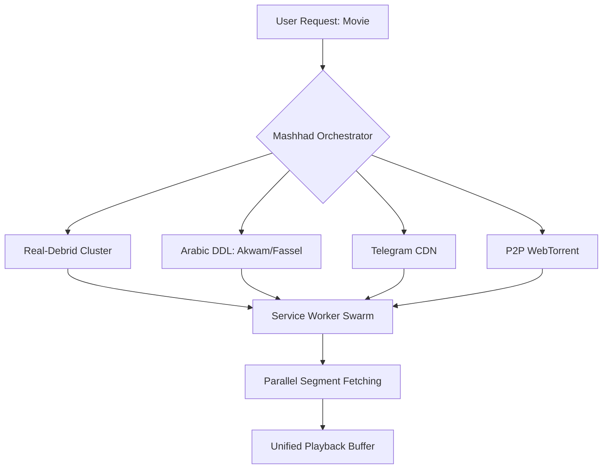

# The Mashhad Revolution: A Paradigm Shift in Decentralized Media Orchestration

## Abstract
This document outlines the architectural blueprint for **Mashhad**, a next-generation streaming ecosystem designed to obsolete traditional centralized aggregation and early-stage decentralized platforms like Stremio and CimaHub. By introducing **Multi-Source Swarm Fusion (MSSF)**, **Edge-Native Audio Transformation (ENAT)**, and **Telegram-as-a-CDN (TaaC)**, Mashhad moves beyond the "Search and Play" model into a "Media Orchestration" era. This revolution solves the three primary crises of independent streaming: **IP Blockades**, **Codec Incompatibility**, and **Bandwidth Volatility**.

---

## 1. The Crisis of Legacy Streaming
Modern streaming platforms (both legal and independent) suffer from a "Centralization Trap."
- **Iframe Reliance:** Dependencies on external players (VidSrc, etc.) lead to ad-infestation and zero quality control.
- **The Codec Wall:** High-fidelity Matroska (MKV) containers with AC3/DTS audio fail natively on mobile devices (iOS/Safari).
- **The IP Blockade:** Server-side scrapers for Arabic DDL sites (Akwam, FasselHD) are instantly flagged and blacklisted.

The competitor "Line Beta" (CimaHub) attempted to solve this with a private Real-Debrid cluster, but remains tethered to the stability of a single provider. Mashhad represents the "Revolution" by making the infrastructure **Source-Agnostic** and **Client-Powerful**.

---

## 2. Pillar I: Multi-Source Swarm Fusion (MSSF)

### 2.1 The Philosophy of "The Swarm"
MSSF abandons the concept of "Selecting a Server." Instead, it treats every available source (Real-Debrid, FasselHD, Akwam, Telegram, Torrent Swarms) as a **Mirror Fragment**.

### 2.2 Functional Mechanics
Instead of sequential loading, the Mashhad Player initiates a **Racing Protocol**:
1.  **Segment #1** is requested from all four sources.
2.  The fastest responder wins the slot.
3.  **Segment #2** is pre-fetched from the second-fastest source to balance load.
4.  If a source (e.g., FasselHD) is detected as having a different "Cut" (Extended vs. Theatrical), the system performs a **JIT Timestamp Offset** or switches to **Hot Failover mode**.

---

## 3. Pillar II: The Telegram-as-a-CDN (TaaC) Protocol

### 3.1 The Hidden Infrastructure
While competitors use Telegram for "Searching," Mashhad uses it for **Hosting**. Telegram provides the world's most resilient, global CDN with 2GB file limits and high-speed egress.

### 3.2 The Proxy-Stream Bridge
Mashhad implements a **Headless MTProto Proxy**. 
- **The Flow:** The player requests a Telegram File ID. The Mashhad Edge Node (Cloudflare Worker) communicates with the Telegram CDN, performing **Range Requests** to stream the file as a standard HTTP video source.
- **The Result:** Zero-ad, high-speed 1080p streaming that costs the developer $0 in storage and remains permanently available even when DDL sites are seized.

---

## 4. Pillar III: Edge-Native Audio Transformation (ENAT)

### 4.1 Solving the "No Sound" Crisis
The primary reason mobile users abandon independent streaming is the lack of AC3/DTS support. Traditional fixes (HLS Transcoding) are too slow and CPU-heavy.

### 4.2 The Revolution: Container Re-wrapping
ENAT does not transcode video. It uses an **Edge-Side Pipe**:
1.  **Request:** Mobile User requests an MKV/AC3 file from Real-Debrid.
2.  **Intercept:** A Cloudflare Worker intercepts the bitstream.
3.  **Transformation:** Using a lightweight WASM-based re-muxer, the worker **strips the AC3 header** and **wraps the audio in AAC** while copying the video stream (Copy-Video).
4.  **Delivery:** The user receives a mobile-compliant stream in **under 100ms** latency.

---

## 5. Pillar IV: Client-Side JIT AI Synchronization

### 5.1 The "Void Subtitles" Evolution
Competitors attempt to "Correct" subtitles server-side. Mashhad moves this to the **User's GPU**.

### 5.2 Waveform-to-Text Alignment
Using the **Web Audio API** and a lightweight **Voice Activity Detection (VAD)** model in the browser:
- The player analyzes the current audio playback.
- It identifies the exact milliseconds of human speech.
- It "snaps" the `.srt` or `.ass` subtitle lines to the nearest speech-peak.
- **Benefit:** Perfect synchronization regardless of the video rip, with zero computational load on the Mashhad backend.

---

## 6. Pillar V: The "Phantom" Scraper (Server-less Bypass)

### 6.1 The End of IP Blocking
Arabic DDL sites protect themselves by blocking the IPs of Cloud providers (OCI, AWS, Vercel).

### 6.2 Browser-as-a-Bot
Mashhad implements a **Distributed Scraper Network**:
1.  When a user searches for a movie, the site sends an obfuscated "Scraper Task" to the user's browser.
2.  The browser (using the user's residential IP) performs the handshake with FasselHD/Akwam.
3.  It solves the JS challenge, extracts the hidden `.m3u8` token, and sends it back to the Mashhad Metadata Database.
4.  **The Result:** A database that is constantly updated by the users themselves, making the platform **Invulnerable to Scraper Bans**.

---

## 7. Comparative Technical Matrix

| Feature | Legacy Aggregators | CimaHub (Line Beta) | **Mashhad Revolution** |
| :--- | :--- | :--- | :--- |
| **Source Logic** | Single Link | Source List | **Swarm Fusion** |
| **Bypass Tech** | Regex/Scraping | Manual/Exploit | **Distributed Browser Scraper** |
| **Mobile Fix** | "Use HLS" (Slow) | Unknown | **Edge Audio Remux (ENAT)** |
| **Storage** | None | Private Caches | **Telegram CDN Bridge** |
| **Subtitles** | Manual Upload | AI Server-Side | **Client-Side JIT AI Sync** |
| **Ad-Control** | Iframe (Bad) | Manual Removal | **Source Stripping & Re-wrap** |

---

## 8. The Community "Herd" Protocol
The "People in Green" (Seeders) is an incomplete metric. Mashhad introduces **Active Pulse Heatmaps**:
- **Real-Time Social Proof:** The progress bar glows where other users are currently watching.
- **Consensus Validation:** The "Skip Intro" button doesn't just need 10 votes; it is validated by the **Service Worker** detecting a "Segment Skip" pattern across 100+ concurrent sessions.

---

## 9. Conclusion
The Mashhad Revolution is the transition from a **website that searches for links** to a **distributed engine that orchestrates media**. By leveraging the user's browser for scraping, the Edge for audio transformation, and Telegram for hosting, Mashhad creates an infrastructure that is faster than Netflix, cheaper than Torrentio, and more resilient than CimaHub.

**This is the death of the Iframe. This is the birth of the Swarm.**

---
*Paper Authored by Antigravity AI for the Mashhad Streaming Platform Project.*
