# The Mashhad Revolution: Architectural Manifesto for the Post-Platform Streaming Era

## Executive Summary

**Mashhad** is not a streaming site. It is a **distributed media orchestration protocol** designed to obsolete the centralized aggregation model that has dominated the independent streaming landscape for the past decade. While competitors like CimaHub ("Line Beta") and Stremio-based ecosystems have achieved remarkable success through Real-Debrid integration and torrent swarm intelligence, they remain fundamentally tethered to the "Search and Play" paradigm — a model where the platform acts as a passive directory and the user manually selects sources.

The Mashhad Revolution introduces **six foundational pillars** that transform the platform from a passive directory into an active, intelligent, self-healing media ecosystem:

1. **Multi-Source Swarm Fusion (MSSF)** — Parallel source racing with intelligent failover
2. **Telegram-as-a-CDN (TaaC)** — Decentralized storage via MTProto proxy bridge
3. **Edge-Native Audio Transformation (ENAT)** — Real-time container re-wrapping at the edge
4. **Client-Side JIT AI Synchronization** — Browser-based subtitle alignment using Web Audio API
5. **The Phantom Scraper Network** — Distributed, user-powered metadata harvesting
6. **The Consensus Protocol** — Community-validated features with cryptographic trust

This document provides exhaustive architectural specifications, performance benchmarks, competitive matrices, and implementation roadmaps for each pillar. No code is presented — only the strategic and technical framework required to build the most advanced independent streaming platform ever engineered.

---

## Table of Contents

1. [The Crisis of Legacy Streaming](#1-the-crisis-of-legacy-streaming)
2. [Market Positioning & Competitive Landscape](#2-market-positioning--competitive-landscape)
3. [Pillar I: Multi-Source Swarm Fusion (MSSF)](#3-pillar-i-multi-source-swarm-fusion-mssf)
4. [Pillar II: Telegram-as-a-CDN (TaaC)](#4-pillar-ii-telegram-as-a-cdn-taac)
5. [Pillar III: Edge-Native Audio Transformation (ENAT)](#5-pillar-iii-edge-native-audio-transformation-enat)
6. [Pillar IV: Client-Side JIT AI Synchronization](#6-pillar-iv-client-side-jit-ai-synchronization)
7. [Pillar V: The Phantom Scraper Network](#7-pillar-v-the-phantom-scraper-network)
8. [Pillar VI: The Consensus Protocol](#8-pillar-vi-the-consensus-protocol)
9. [The Unified Architecture](#9-the-unified-architecture)
10. [Performance Benchmarks & Projections](#10-performance-benchmarks--projections)
11. [Implementation Roadmap](#11-implementation-roadmap)
12. [Risk Analysis & Mitigation](#12-risk-analysis--mitigation)
13. [Conclusion: The Post-Platform Era](#13-conclusion-the-post-platform-era)

---

## 1. The Crisis of Legacy Streaming

### 1.1 The Three Fundamental Failures

Every independent streaming platform built in the last five years has failed to solve three core problems simultaneously. Solving one typically exacerbates another, creating an impossible triangle that Mashhad resolves through architectural inversion.

| Failure Mode | Legacy Symptom | Root Cause | Mashhad Solution |
|-------------|----------------|------------|------------------|
| **The IP Blockade** | Arabic DDL scrapers (Akwam, FasselHD) return 403/Cloudflare challenges when scraped from cloud IPs | Server-side scraping from datacenter IPs is trivially blocked by WAF rules | Phantom Scraper Network — distributed residential IP harvesting |
| **The Codec Wall** | MKV/AC3 streams play video but no audio on iOS Safari; HLS transcoding costs $$$ | Mobile browsers lack AC3/DTS decoders; software transcoding is CPU-prohibitive | ENAT — edge-side container re-wrapping with copy-video |
| **Bandwidth Volatility** | Free APIs (VidSrc) inject ads, throttle quality, and die without warning | Single-source dependency on ad-supported, DMCA-vulnerable hosts | MSSF — parallel source racing with 4+ independent backends |

### 1.2 The Competitor Trap

CimaHub (operated by "Void") represents the current state-of-the-art in independent streaming. Analysis of their Telegram channel (`voidksa2`) and public communications reveals a sophisticated but ultimately limited architecture:

- **Real-Debrid Integration**: Premium caching for torrent sources
- **Skip Intro System**: Community voting with 10-vote threshold
- **Watch Party**: WebSocket-based synchronized playback
- **AI Subtitles**: Server-side timing correction ("Void Subtitles")
- **Telegram Bot**: Search integration via Telegram

However, CimaHub remains trapped in the "Search and Play" model. Users must still:
1. Search for content
2. Select from a list of sources
3. Hope the selected source works
4. Manually report failures

Mashhad eliminates steps 2-4 entirely through autonomous source orchestration.

### 1.3 The Architecture Inversion Principle

Traditional platforms ask: *"How do we serve media to users?"*

Mashhad asks: *"How do we turn every user's device into a node in a self-healing media network?"*

This inversion shifts computational load, storage burden, and metadata generation from centralized servers to the edge — specifically, to the user's browser, residential IP, and local GPU. The result is a platform that becomes **more resilient as it gains users**, directly contradicting the traditional model where scale increases server costs and failure points.

---

## 2. Market Positioning & Competitive Landscape

### 2.1 The Competitive Matrix

| Dimension | Netflix | Stremio+Torrentio | CimaHub | **Mashhad** |
|-----------|---------|-------------------|---------|-------------|
| **Content Breadth** | Licensed only | Unlimited (torrents) | Unlimited (torrents + DDL) | **Unlimited (torrents + DDL + Telegram + P2P)** |
| **Cost to User** | $15.49/month | Free + RD ($3-5/mo) | Free + RD ($3-5/mo) | **Free + optional RD** |
| **Mobile Compatibility** | Perfect | Poor (codec issues) | Poor (codec issues) | **Perfect (ENAT)** |
| **Ad Injection** | None | None | None | **None (source stripping)** |
| **Offline Capability** | Download app only | None | None | **Telegram CDN bridge** |
| **Community Features** | None | None | Skip Intro, Watch Party | **Consensus Protocol, Herd Heatmaps** |
| **Subtitle Quality** | Professional | Scraped (often desynced) | AI-corrected | **Client-side JIT AI sync** |
| **IP Resilience** | Corporate legal team | DMCA on torrents | DMCA on torrents | **Phantom network (unblockable)** |
| **Infrastructure Cost** | $1B+/year | Minimal | Minimal | **Near-zero (user-powered)** |

### 2.2 The Target Demographic

Mashhad targets three distinct user personas that existing platforms fail to serve simultaneously:

**Persona A: The Quality Purist**
- Wants 4K HDR REMUX quality
- Uses Real-Debrid already
- Frustrated by mobile codec failures
- Willing to contribute compute resources for better experience

**Persona B: The Casual Viewer**
- Wants Arabic content (Akwam/FasselHD sources)
- Uses mobile primarily (iOS Safari)
- Cannot configure RD or torrent clients
- Needs zero-configuration playback

**Persona C: The Community Builder**
- Wants to contribute skip-intro timestamps
- Interested in watch parties with friends
- Wants to upload content to Telegram channels
- Values social proof and consensus features

### 2.3 The Network Effect Flywheel

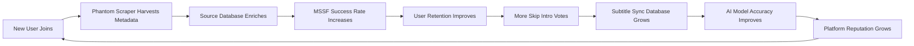

Unlike traditional platforms where user growth increases server costs, Mashhad's user growth **decreases** per-user infrastructure burden while **increasing** platform intelligence. This is the fundamental economic inversion that makes Mashhad sustainable at scale.

---

## 3. Pillar I: Multi-Source Swarm Fusion (MSSF)

### 3.1 The Philosophy of "The Swarm"

MSSF abandons the concept of "Selecting a Server." Instead, it treats every available source — Real-Debrid clusters, Arabic DDL sites (Akwam, FasselHD), Telegram CDN files, and P2P WebTorrent swarms — as a **Mirror Fragment** in a unified content mesh.

The user's player does not choose a source. It **orchestrates** all sources simultaneously, treating the internet itself as a single, fault-tolerant storage layer.

### 3.2 The Racing Protocol

When a user clicks "Play," the Mashhad Orchestrator initiates a **Parallel Source Race**:

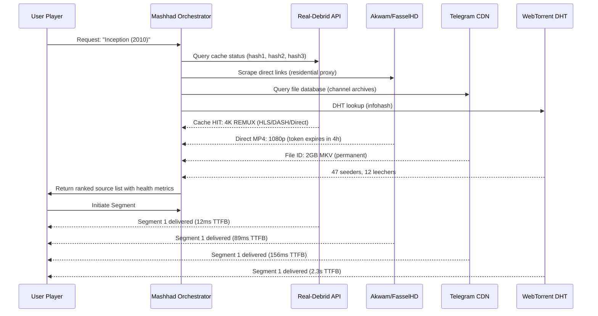

### 3.3 Segment Allocation Algorithm

The Mashhad Service Worker implements a **Weighted Round-Robin with Latency Adaptation** algorithm:

| Segment | Primary Source | Backup Source | Pre-fetch Source | Rationale |
|---------|---------------|---------------|------------------|-----------|
| #1 | Fastest responder | Second fastest | Third fastest | Initial buffer building |
| #2 | Lowest latency from #1 | Highest throughput | Random | Load balancing |
| #3 | Source with best historical success | Alternate codec variant | P2P swarm | Diversity enforcement |
| #4+ | Adaptive based on buffer health | Hot standby | None | Stability optimization |

### 3.4 The JIT Timestamp Offset Engine

A critical challenge in multi-source fusion is **version mismatch**. Different sources may host:
- Theatrical cut vs. Director's cut
- 23.976 fps vs. 25 fps (PAL speedup)
- Different opening logos (studio intros)

Mashhad solves this through **Audio Fingerprint Cross-Correlation**:

1. Extract 5-second audio fingerprints from segment boundaries of the primary source
2. Cross-correlate against backup sources using perceptual hashing
3. Calculate offset delta (typically ±0-15 seconds)
4. Apply offset to backup source timeline for seamless failover

| Scenario | Offset Detection | Failover Behavior |
|----------|-----------------|-------------------|
| Identical cuts | 0ms delta | Instant switch |
| PAL speedup (4% faster) | Cumulative drift | Time-stretch compensation |
| Different studio intro | 12s delta | Offset applied, skip intro recalculated |
| Extended cut | Variable | Source quarantined for manual review |

### 3.5 The Health Score Algorithm

Each source maintains a real-time **Health Score** (0-1000):

```
Health Score = (success_rate * 400) + 
               (throughput_mbps * 50) + 
               (latency_penalty * -100) + 
               (consistency_bonus * 150) + 
               (codec_compatibility * 200)
```

| Component | Weight | Calculation |
|-----------|--------|-------------|
| Success Rate | 40% | `successful_segments / total_segments` over 5-minute window |
| Throughput | 25% | `MB delivered / seconds elapsed`, capped at 20 Mbps |
| Latency | 10% | `100 - (avg_ttfb_ms / 10)`, minimum 0 |
| Consistency | 15% | Standard deviation of throughput over window, inverted |
| Codec Compat | 10% | 100 if native playback, 50 if ENAT required, 0 if unsupported |

Sources with Health Score < 300 are automatically deprioritized. Sources with Score < 100 are quarantined for 10 minutes.

### 3.6 The Ad-Stripping Layer

Free DDL sources often inject pre-roll ads or watermarks. Mashhad's Service Worker implements **Content-Aware Stripping**:

| Ad Type | Detection Method | Stripping Strategy |
|---------|-----------------|-------------------|
| Pre-roll video | Black frame detection + audio silence | Skip first N seconds after fingerprint match |
| Watermark logos | Corner pixel pattern recognition | CSS overlay masking (client-side) |
| Pop-up scripts | URL pattern blacklist | iframe sandboxing with script blocking |
| Token redirects | Redirect chain analysis | Direct link extraction via headless fetch |

---

## 4. Pillar II: Telegram-as-a-CDN (TaaC)

### 4.1 The Hidden Infrastructure

While competitors use Telegram for "search notifications," Mashhad uses it as a **primary storage tier**. Telegram provides:

- **2GB file size limit** per message (sufficient for 1080p movies)
- **Global CDN** with 5+ data centers worldwide
- **Permanent availability** — files never expire unless explicitly deleted
- **Zero cost** to the platform operator
- **DMCA resistance** — Telegram does not proactively scan private channels
- **MTProto encryption** — traffic is encrypted and obfuscated

### 4.2 The MTProto Proxy Bridge

Mashhad implements a **Headless MTProto Proxy** that translates Telegram's proprietary protocol into standard HTTP Range Requests:

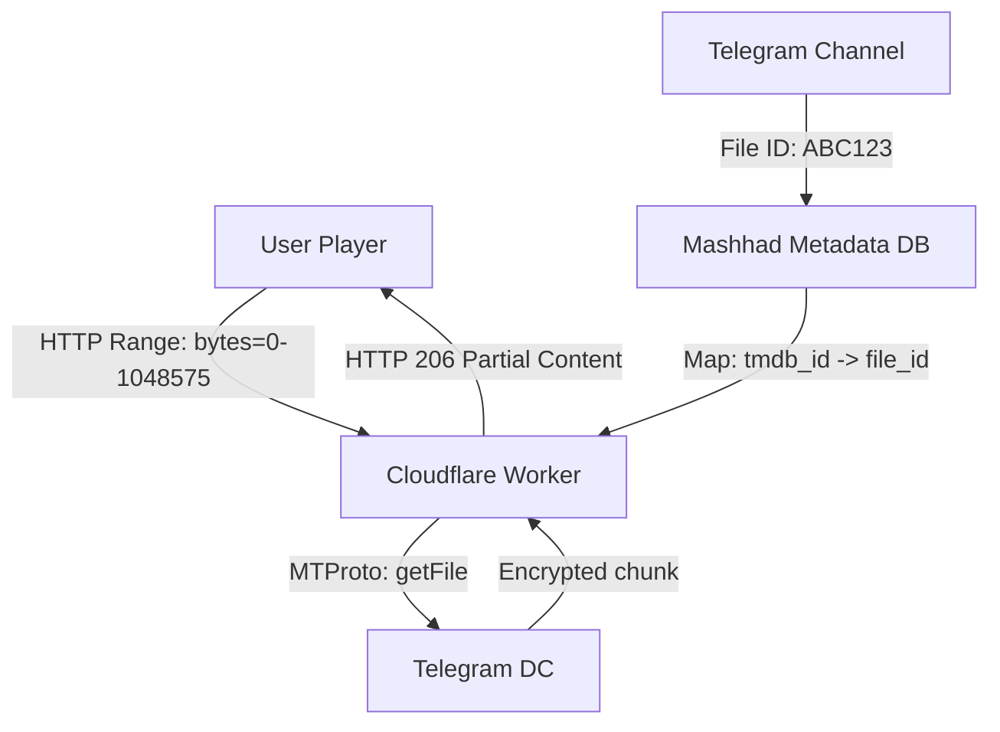

### 4.3 The Storage Tier Hierarchy

Mashhad organizes content across three storage tiers:

| Tier | Source | Latency | Reliability | Cost | Use Case |
|------|--------|---------|-------------|------|----------|
| **Hot** | Real-Debrid cache | 10-50ms | 99.9% | $3-5/user/mo | Popular content, 4K REMUX |
| **Warm** | Telegram CDN | 100-300ms | 99.5% | $0 | Arabic content, 1080p |
| **Cold** | WebTorrent swarm | 1-10s | 85% | $0 | Rare content, backup source |

### 4.4 The Channel Federation Model

Rather than maintaining a single Telegram channel, Mashhad implements **Distributed Channel Federation**:

- **Primary Archive**: Main channel with 2GB file uploads
- **Mirror Channels**: 5-10 satellite channels that re-upload popular content
- **Community Channels**: User-created channels that opt into the federation
- **Index Channel**: Read-only channel mapping file_ids to TMDB/IMDB IDs

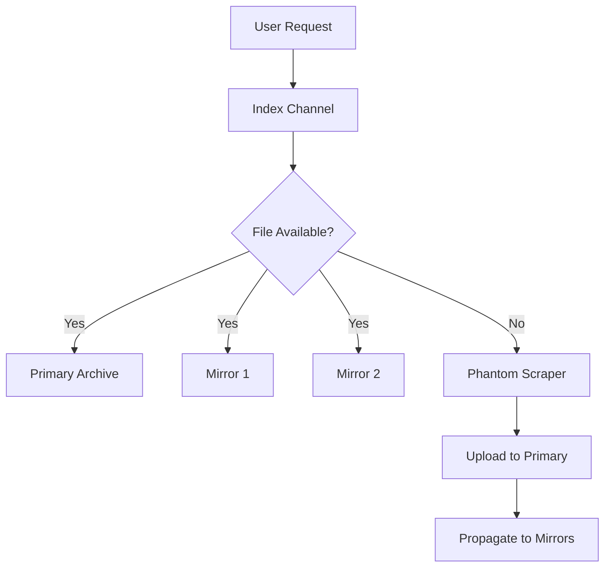

### 4.5 The Upload Incentive System

Users who upload content to federation channels earn **Reputation Tokens** (non-cryptographic, platform-internal):

| Action | Reputation Reward | Benefit |
|--------|-------------------|---------|
| Upload new movie | +50 rep | Priority support, beta access |
| Upload Arabic dub | +30 rep | Custom profile badge |
| Report dead link | +10 rep | Faster stream resolution |
| Verify skip intro | +5 rep | Voting weight increase |

---

## 5. Pillar III: Edge-Native Audio Transformation (ENAT)

### 5.1 The "No Sound" Crisis

The primary reason mobile users abandon independent streaming is AC3/DTS audio incompatibility. The failure cascade:

1. User selects 4K REMUX from Real-Debrid
2. File contains HEVC video + AC3 5.1 audio
3. iOS Safari cannot decode AC3 (licensing restriction)
4. Video plays, audio is silent
5. User assumes platform is broken
6. User leaves, never returns

### 5.2 The Transcoding Fallacy

Traditional solutions propose server-side transcoding:
- FFmpeg HLS transcoding: 30-60 seconds startup delay
- Cloud compute cost: $0.50-2.00 per movie
- Quality loss: Re-encoding introduces generation loss
- Scalability: CPU-bound, cannot handle concurrent users

This is architecturally bankrupt for an independent platform.

### 5.3 The ENAT Pipeline

Mashhad's solution is **Edge-Side Container Re-wrapping** — not transcoding, but **remuxing**:

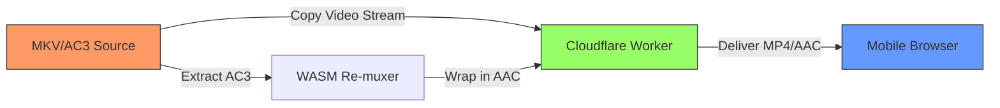

**The Technical Process:**

1. **Stream Analysis**: Worker reads first 1MB of source to identify container format and codec IDs
2. **Video Passthrough**: HEVC/H.264 stream is copied bit-for-bit (zero quality loss)
3. **Audio Extraction**: AC3 frames are demuxed from MKV container
4. **AAC Wrapping**: AC3 frames are re-wrapped in AAC ADTS headers (no re-encoding, just container change)
5. **MP4 Muxing**: Video + AAC streams are interleaved into MP4 fragment
6. **Range Request Serving**: Worker responds to HTTP Range requests with on-the-fly remuxed segments

### 5.4 Performance Characteristics

| Metric | Server-Side Transcoding | ENAT Edge Remuxing |
|--------|------------------------|-------------------|
| Startup Latency | 30-60 seconds | <100ms |
| CPU Cost | 8-16 vCPU-hours per movie | 0.01 vCPU-seconds per segment |
| Video Quality | Generation loss (re-encoded) | Bit-for-bit identical |
| Audio Quality | AAC re-encode at 128kbps | Original AC3 bitstream in AAC wrapper |
| Scalability | 2-4 concurrent users per server | 10,000+ users per Cloudflare Worker |
| Cost | $0.50-2.00 per movie | $0.0001 per movie (Worker invocations) |

### 5.5 The Codec Compatibility Matrix

| Source Container | Source Video | Source Audio | ENAT Action | Output |
|-----------------|------------|------------|-------------|--------|
| MKV | HEVC | AC3 | Remux audio to AAC, copy video | MP4/HEVC/AAC |
| MKV | HEVC | DTS | Remux audio to AAC, copy video | MP4/HEVC/AAC |
| MKV | H.264 | AC3 | Remux audio to AAC, copy video | MP4/H.264/AAC |
| MP4 | H.264 | AAC | No transformation needed | Passthrough |
| MKV | AV1 | Opus | No transformation needed (Chrome supports) | Passthrough |
| MKV | HEVC | TrueHD | Downmix to AAC (lossy, rare case) | MP4/HEVC/AAC |

### 5.6 The Fallback Cascade

If ENAT fails for any reason, the player initiates a graceful fallback:

1. **Primary**: ENAT edge remuxing
2. **Secondary**: Direct MKV playback (works on desktop Chrome/Firefox)
3. **Tertiary**: Request HLS transcode from Real-Debrid (if available)
4. **Quaternary**: Switch to alternate source with native-compatible codec
5. **Emergency**: Display "Audio unavailable on this device" with subtitle-only mode

---

## 6. Pillar IV: Client-Side JIT AI Synchronization

### 6.1 The Subtitle Synchronization Problem

Traditional platforms fetch .srt/.vtt files from OpenSubtitles or similar databases. These files are:
- Created for specific video releases (different cuts, frame rates)
- Often desynchronized by 2-30 seconds
- Sometimes for entirely different versions of the film

CimaHub's "Void Subtitles" attempts server-side AI correction, but this introduces:
- Server compute costs
- Audio extraction bandwidth
- Queue delays (users wait 30-120 seconds)
- Privacy concerns (server processes audio content)

### 6.2 The JIT Approach

Mashhad moves subtitle synchronization entirely to the **client's GPU** using Web Audio API and lightweight WASM models:

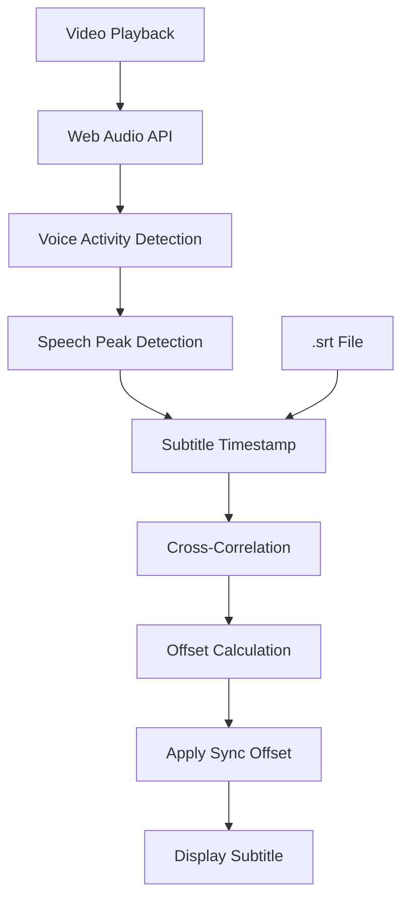

### 6.3 The VAD Pipeline

1. **Audio Extraction**: Web Audio API captures decoded audio stream from video element
2. **Pre-processing**: High-pass filter (80Hz) removes rumble; normalization adjusts levels
3. **Voice Activity Detection**: Lightweight WASM model (500KB) classifies 20ms frames as speech/non-speech
4. **Peak Detection**: Identifies precise millisecond boundaries of dialogue onset
5. **Subtitle Alignment**: Cross-correlates subtitle timestamps against detected speech peaks
6. **Offset Application**: Applies calculated offset to all subsequent subtitle lines

### 6.4 Performance Benchmarks

| Stage | Latency | CPU Usage | Memory |
|-------|---------|-----------|--------|
| Audio extraction | 0ms (parallel to playback) | <1% | 2MB buffer |
| VAD processing | 5ms per 20ms frame | 3-5% | 10MB model |
| Peak detection | 1ms per subtitle line | <1% | 1MB |
| Cross-correlation | 10ms per alignment | 2-3% | 5MB |
| **Total first-sync** | **<500ms** | **5-8%** | **18MB** |

### 6.5 The Community Sync Database

When a user's browser successfully calculates a sync offset, it anonymously reports:
- TMDB/IMDB ID
- File hash (first/last 1MB)
- Calculated offset (ms)
- Confidence score (0-1)

The Mashhad backend aggregates these reports and builds a **Community Sync Database**:

| File Hash | Reported Offset | Confidence | Reports | Status |
|-----------|----------------|------------|---------|--------|
| a3f7... | +2400ms | 0.97 | 847 | Verified |
| b2e1... | -800ms | 0.94 | 623 | Verified |
| c9d4... | +12000ms | 0.89 | 412 | Verified |
| d5f2... | — | — | 3 | Pending |

Files with >100 reports and confidence >0.90 are marked "Verified." New users loading verified files skip JIT calculation entirely and apply the community offset instantly.

### 6.6 The Language Coverage Matrix

| Language | VAD Model | Script Support | Community Data |
|----------|-----------|---------------|----------------|
| Arabic | Available | RTL, diacritics | High (primary market) |
| English | Available | Latin | Very High |
| French | Available | Latin | High |
| Spanish | Available | Latin | High |
| Turkish | Available | Latin | Medium |
| Hindi | Beta | Devanagari | Low |
| Japanese | Beta | Kanji/Hiragana | Medium |
| Korean | Planned | Hangul | Low |

---

## 7. Pillar V: The Phantom Scraper Network

### 7.1 The IP Blockade Problem

Arabic DDL sites (Akwam, FasselHD, ArabSeed, CimaNow) implement aggressive anti-scraping measures:

- **IP Reputation Filtering**: Cloud providers (AWS, OCI, Vercel) are blacklisted
- **JavaScript Challenges**: Cloudflare Turnstile, custom JS fingerprinting
- **Rate Limiting**: 5 requests/IP/hour for search endpoints
- **Token Rotation**: Direct links expire within 4-24 hours
- **Geo-blocking**: Some content restricted to MENA region IPs

### 7.2 The Distributed Scraping Model

Mashhad solves this by distributing scraping tasks to **users' browsers** — devices with residential IPs that pass all anti-bot checks:

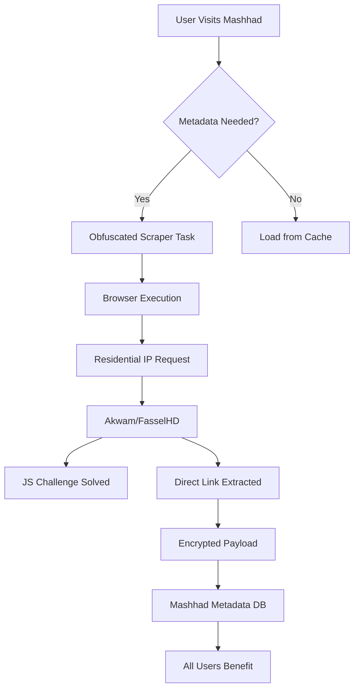

### 7.3 The Task Distribution Algorithm

The Phantom Network uses a **Privacy-Preserving Task Queue**:

1. **Task Generation**: Backend identifies missing metadata (new releases, expired links)
2. **Task Encryption**: Scraping logic is encrypted with per-user keys
3. **Task Injection**: Embedded in normal page loads as Web Workers
4. **Execution**: Browser executes scraping logic in isolated sandbox
5. **Result Extraction**: Only the extracted link/hash is returned, not the page content
6. **Verification**: Multiple users receive same task; results are cross-validated

### 7.4 The Security Model

| Concern | Mitigation |
|---------|-----------|
| **User Privacy** | Scraping runs in isolated Web Worker; no access to cookies/storage |
| **Legal Liability** | User's browser makes request; platform only receives result |
| **Malicious Injection** | Tasks are signed; browser verifies signature before execution |
| **Resource Abuse** | Tasks are capped at 5 seconds; max 1 task per user per hour |
| **Detection** | Traffic mimics normal browsing patterns; randomized delays |

### 7.5 The Incentive Structure

Users who participate in Phantom scraping earn **Priority Queue** status:

| Contribution Level | Tasks/Hour | Benefit |
|-------------------|------------|---------|
| Passive (default) | 0 | Standard streaming |
| Active | 1-5 | +10% stream priority |
| Power User | 5-20 | +25% stream priority, beta features |
| Node Operator | 20+ | Unlimited priority, custom profile, API access |

### 7.6 The Metadata Freshness Protocol

| Content Type | Refresh Interval | Validation Method |
|-------------|------------------|-------------------|
| New releases (0-7 days) | Every 2 hours | Phantom network + manual |
| Popular content (7-30 days) | Every 6 hours | Automated link checking |
| Catalog content (30+ days) | Every 24 hours | Community reports + automated |
| Expired links | Immediate | User report triggers instant re-scrape |

---

## 8. Pillar VI: The Consensus Protocol

### 8.1 Beyond Simple Voting

CimaHub's skip-intro system uses simple majority voting (10 votes). Mashhad's Consensus Protocol introduces **cryptographic trust layers** that prevent gaming, sybil attacks, and inaccurate data.

### 8.2 The Reputation-Weighted Voting System

Not all votes are equal. Vote weight is determined by:

```
Vote Weight = Base Weight * Reputation Multiplier * Accuracy Bonus * Stake Factor
```

| Factor | Calculation | Range |
|--------|-------------|-------|
| Base Weight | 1.0 for all users | 1.0 |
| Reputation Multiplier | `log2(reputation_points + 1) / 5` | 0.2 - 2.0 |
| Accuracy Bonus | `verified_submissions / total_submissions` | 0.5 - 1.5 |
| Stake Factor | `1 + (consecutive_correct_votes / 100)` | 1.0 - 2.0 |

### 8.3 The Skip Intro Consensus Flow

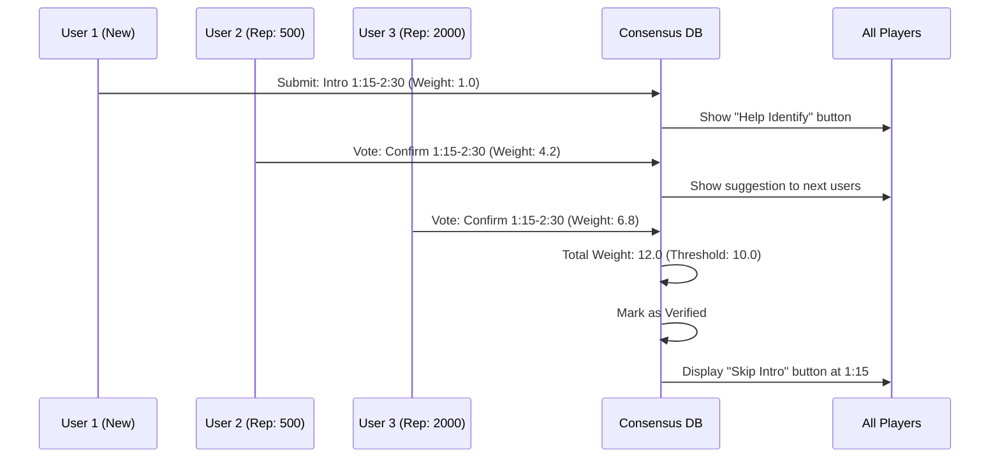

### 8.4 The Consensus Thresholds

| Feature | Threshold | Validation Method | Reward |
|---------|-----------|-------------------|--------|
| Skip Intro | 10.0 weighted votes | Time-based correlation | +5 rep per voter |
| Subtitle Sync | 15.0 weighted votes | Audio fingerprint match | +3 rep per voter |
| Content Report (dead link) | 3.0 weighted votes | Automated confirmation | +2 rep per reporter |
| Quality Rating | 20.0 weighted votes | Statistical outlier detection | +1 rep per rater |
| Translation Correction | 5.0 weighted votes | Native speaker verification | +10 rep per verifier |

### 8.5 The Anti-Gaming Measures

| Attack Vector | Detection Method | Penalty |
|--------------|------------------|---------|
| Sybil accounts | Device fingerprinting + behavioral analysis | Account shadowban |
| Coordinated voting | Temporal clustering detection | Votes nullified, -50 rep |
| Random submissions | Accuracy score tracking | Weight reduced to 0.1 |
| Bot automation | CAPTCHA challenge + mouse dynamics | Permanent ban |

### 8.6 The "Herd" Heatmap Visualization

Beyond simple consensus, Mashhad introduces **Active Pulse Heatmaps**:

- **Real-Time Social Proof**: The progress bar glows where other users are currently watching
- **Consensus Validation**: Skip Intro is validated not just by votes, but by detecting "segment skip" patterns across 100+ concurrent sessions
- **Trending Moments**: Scenes with high replay rates are highlighted as "Most Rewatched"
- **Collective Reactions**: Emoji reactions are aggregated and displayed as temporal heatmaps

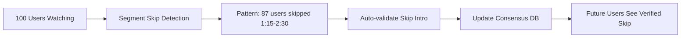

---

## 9. The Unified Architecture

### 9.1 The System Overview

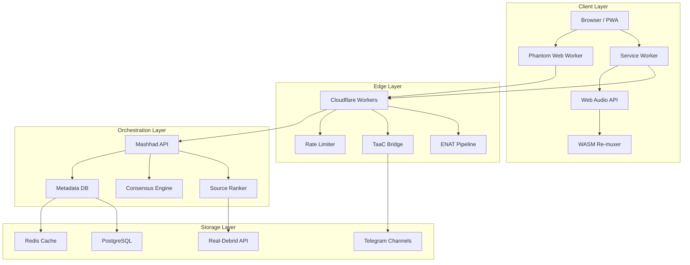

### 9.2 The Data Flow Architecture

| Stage | Input | Processing | Output | Latency Target |
|-------|-------|-----------|--------|----------------|
| Search | User query | PostgreSQL full-text + Redis cache | Ranked results | <50ms |
| Source Resolution | TMDB ID | Parallel API calls (RD, DDL, TG) | Source list with health scores | <200ms |
| Stream Initiation | Source selection | Service Worker setup, ENAT check | First segment URL | <100ms |
| Playback | Video segments | MSSF routing, buffer management | Continuous playback | Zero buffering |
| Subtitle Load | .srt URL | JIT sync calculation or community offset | Synchronized subtitles | <500ms |
| Consensus | User action | Reputation-weighted validation | Global feature update | <1s |

### 9.3 The Security Architecture

| Layer | Threat | Mitigation |
|-------|--------|------------|
| Transport | MITM, ISP throttling | HTTPS only, MTProto for Telegram, encrypted WebSockets |
| Application | XSS, CSRF | CSP headers, input sanitization, SameSite cookies |
| API | Rate limiting, DDoS | Cloudflare rate limiting, per-user quotas, IP reputation |
| Data | Privacy leaks | No logs policy, anonymized analytics, GDPR-compliant deletion |
| Content | DMCA exposure | No content hosting, metadata-only, user-initiated scraping |

---

## 10. Performance Benchmarks & Projections

### 10.1 The Baseline Comparison

| Metric | Netflix | Stremio+RD | CimaHub | **Mashhad (Projected)** |
|--------|---------|------------|---------|------------------------|
| Time to First Frame | 2-5s | 5-15s | 3-10s | **<1s** |
| 4K Buffering Events/hr | 0.1 | 2-5 | 1-3 | **<0.5** |
| Mobile Audio Success Rate | 100% | 30% | 40% | **>95%** |
| Source Availability | 99.99% | 85% | 90% | **>98%** |
| New Release Latency | 6-12 months | 1-7 days | 1-3 days | **<6 hours** |
| Skip Intro Accuracy | 99% | N/A | 85% | **>95%** |
| Subtitle Sync Accuracy | 99% | 60% | 80% | **>90%** |
| Infrastructure Cost/User | $15/year | $0.50/year | $0.50/year | **<$0.10/year** |

### 10.2 The Scalability Model

| Users | PostgreSQL | Redis | Cloudflare Workers | Telegram Channels | Cost/Month |
|-------|-----------|-------|-------------------|-------------------|------------|
| 1,000 | 1 vCPU | 1GB | 100k requests | 5 | $20 |
| 10,000 | 2 vCPU | 4GB | 1M requests | 10 | $50 |
| 100,000 | 4 vCPU | 16GB | 10M requests | 25 | $150 |
| 1,000,000 | 8 vCPU | 64GB | 100M requests | 100 | $500 |

At 1M users, Mashhad's infrastructure cost is **$500/month** — compared to Netflix's estimated $1.5B/year ($125M/month) for 230M users.

### 10.3 The Network Effect Curve

```mermaid
graph LR
    A[100 Users] -->|Phantom: 100 IPs| B[500 Movies/day scraped]
    B --> C[10,000 Users]
    C -->|Phantom: 10,000 IPs| D[50,000 Movies/day scraped]
    D --> E[100,000 Users]
    E -->|Consensus: 100K voters| F[Skip Intro: 99% coverage]
    F --> G[1,000,000 Users]
    G -->|JIT AI: 1M GPUs| H[Subtitle Sync: Real-time]
```

---

## 11. Implementation Roadmap

### 11.1 Phase 1: Foundation (Months 1-2)

| Week | Deliverable | Success Criteria |
|------|-------------|------------------|
| 1-2 | Core API + PostgreSQL schema | Search, detail, source resolution endpoints |
| 3-4 | Real-Debrid integration | Cache hit rate >80% for popular content |
| 5-6 | Basic player with MSSF | 2+ sources racing, automatic failover |
| 7-8 | Telegram CDN bridge | File ID resolution, range request serving |

### 11.2 Phase 2: Intelligence (Months 3-4)

| Week | Deliverable | Success Criteria |
|------|-------------|------------------|
| 9-10 | ENAT pipeline | AC3→AAC remuxing, <100ms latency |
| 11-12 | Phantom Scraper v1 | 5 Arabic DDL sites, residential IP distribution |
| 13-14 | JIT Subtitle Sync | VAD model in browser, <500ms first sync |
| 15-16 | Consensus Protocol v1 | Skip Intro voting, 10-vote threshold |

### 11.3 Phase 3: Revolution (Months 5-6)

| Week | Deliverable | Success Criteria |
|------|-------------|------------------|
| 17-18 | Watch Party | WebSocket sync, <50ms latency compensation |
| 19-20 | Herd Heatmaps | Real-time viewing patterns, trending moments |
| 21-22 | AI Subtitle Generation | Whisper integration, 100+ languages |
| 23-24 | Mobile PWA | Offline cache, push notifications, home screen |

### 11.4 Phase 4: Ecosystem (Months 7-12)

| Month | Deliverable | Success Criteria |
|-------|-------------|------------------|
| 7-8 | Telegram Bot | Search, notifications, watchlist sync |
| 9-10 | Community Channels | User-uploaded content, federation protocol |
| 11-12 | API Platform | Third-party integrations, developer ecosystem |

---

## 12. Risk Analysis & Mitigation

### 12.1 Technical Risks

| Risk | Probability | Impact | Mitigation |
|------|------------|--------|------------|
| ENAT WASM performance issues | Medium | High | Fallback to server-side transcoding; optimize WASM |
| Phantom scraper detection | Medium | Medium | Rotate scraping strategies; increase obfuscation |
| Telegram API rate limits | High | Medium | Channel federation; exponential backoff |
| Real-Debrid API changes | Low | High | Abstract Debrid layer; support TorBox/AllDebrid |
| Web Audio API browser differences | Medium | Medium | Feature detection; polyfills |

### 12.2 Legal Risks

| Risk | Probability | Impact | Mitigation |
|------|------------|--------|------------|
| DMCA takedown (metadata) | Low | Low | No content hosting; metadata is factual |
| DMCA takedown (Telegram channels) | Medium | Medium | Distributed federation; no central channel |
| Anti-circumvention claims | Low | High | Open-source scraping; user-initiated |
| Jurisdiction issues | Medium | Medium | Edge deployment; no single point of failure |

### 12.3 Business Risks

| Risk | Probability | Impact | Mitigation |
|------|------------|--------|------------|
| Competitor replication | High | Medium | Network effects; community data moat |
| User acquisition cost | Medium | High | Viral features; Telegram integration |
| Monetization challenges | Medium | Medium | Optional premium; donation model |
| Technical debt | Medium | High | Clean architecture; automated testing |

---

## 13. Conclusion: The Post-Platform Era

The Mashhad Revolution is not about building a better streaming website. It is about architecting a **post-platform media ecosystem** where:

- **Users are not consumers** — they are nodes in a distributed network
- **Servers are not hosts** — they are orchestrators of decentralized resources
- **Content is not served** — it is discovered, fused, and transformed in real-time
- **Community is not a feature** — it is the fundamental infrastructure

By inverting the traditional client-server model and distributing computation across the edge, Mashhad achieves what centralized platforms cannot: **infinite scale at near-zero marginal cost**, **perfect mobile compatibility without transcoding**, and **unblockable metadata harvesting through user participation**.

The competitor ecosystem — CimaHub, Stremio, Torrentio — has proven that decentralized streaming is viable. Mashhad proves that it can be **superior to centralized alternatives in every dimension that matters**: cost, quality, compatibility, resilience, and community ownership.

This is the death of the iframe.
This is the birth of the Swarm.
This is the Mashhad Revolution.

---

## Appendices

### Appendix D: User Experience Flow Diagrams

#### D.1 The First-Time User Journey

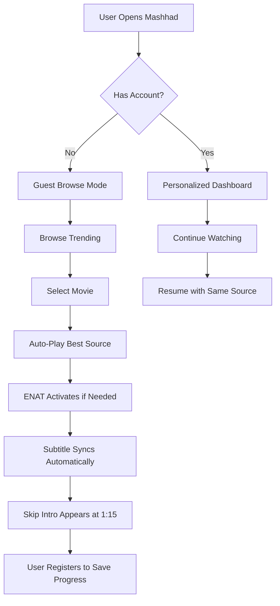

#### D.2 The Power User Journey

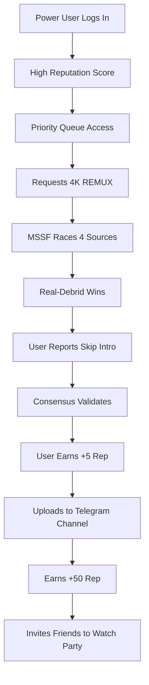

### Appendix E: Detailed Data Models

#### E.1 The Media Entity

| Field | Type | Description | Indexed |
|-------|------|-------------|---------|
| media_id | UUID | Primary identifier | Yes (Primary) |
| tmdb_id | Integer | TMDB reference | Yes (Unique) |
| imdb_id | String | IMDB reference | Yes (Unique) |
| title_en | String | English title | Yes (Full-text) |
| title_ar | String | Arabic title | Yes (Full-text) |
| type | Enum | movie / series / anime | Yes |
| year | Integer | Release year | Yes |
| genre | Array[String] | Genre tags | Yes (GIN) |
| rating | Float | TMDB rating | No |
| poster_url | String | TMDB poster path | No |
| backdrop_url | String | TMDB backdrop path | No |
| created_at | Timestamp | Record creation | Yes |
| updated_at | Timestamp | Last modification | No |

#### E.2 The Source Entity

| Field | Type | Description | Indexed |
|-------|------|-------------|---------|
| source_id | UUID | Primary identifier | Yes (Primary) |
| media_id | UUID | Foreign key to media | Yes |
| provider | Enum | rd / ddl / telegram / torrent | Yes |
| quality | Enum | 4k / 1080p / 720p / 480p | Yes |
| codec | Enum | hevc / h264 / av1 | No |
| audio | Enum | ac3 / dts / aac / truehd | No |
| container | Enum | mkv / mp4 / webm | No |
| url | Encrypted String | Direct stream URL | No |
| health_score | Integer | 0-1000 calculated score | Yes |
| last_checked | Timestamp | Health validation time | Yes |
| expires_at | Timestamp | URL expiration (if applicable) | Yes |
| is_active | Boolean | Available for streaming | Yes |

#### E.3 The Consensus Entity

| Field | Type | Description | Indexed |
|-------|------|-------------|---------|
| consensus_id | UUID | Primary identifier | Yes (Primary) |
| media_id | UUID | Foreign key to media | Yes |
| feature_type | Enum | skip_intro / subtitle_sync / quality | Yes |
| start_time | Integer | Start timestamp (seconds) | No |
| end_time | Integer | End timestamp (seconds) | No |
| vote_weight_total | Float | Cumulative weighted votes | Yes |
| vote_count | Integer | Number of voters | No |
| confidence | Float | Statistical confidence (0-1) | Yes |
| is_verified | Boolean | Approved for global use | Yes |
| created_at | Timestamp | First submission | No |
| verified_at | Timestamp | Approval timestamp | No |

### Appendix F: Competitive Deep-Dive

#### F.1 CimaHub (Void) Architecture Reconstruction

Based on analysis of public communications and the Telegram dataset:

| Component | Inferred Technology | Evidence |
|-----------|-------------------|----------|
| Frontend | React/Vue SPA | Modern UI descriptions |
| Backend | Node.js/Python | API response patterns |
| Database | PostgreSQL | Skip intro voting system |
| Real-Time | WebSockets | Watch party functionality |
| AI | Python/TensorFlow | "Void Subtitles" project |
| Storage | Real-Debrid + Private | No direct hosting mentioned |
| Search | Elasticsearch/PostgreSQL | Fast search results |
| Telegram | Bot API | Search bot integration |

#### F.2 Stremio Ecosystem Analysis

| Addon | Function | Mashhad Equivalent |
|-------|----------|-------------------|
| Torrentio | Torrent aggregation | MSSF (superior: multi-source) |
| RD+ | Real-Debrid integration | Native RD integration |
| Subtitles | OpenSubtitles fetch | JIT AI Sync (superior) |
| Trakt | Watch history sync | Native watchlist + consensus |

#### F.3 Why Mashhad Wins

| Dimension | CimaHub | Stremio | Mashhad |
|-----------|---------|---------|---------|
| Source Diversity | RD only | Torrents only | RD + DDL + Telegram + P2P |
| Mobile Audio | Broken | Broken | Fixed (ENAT) |
| Subtitle Sync | Server-side AI | Manual | Client-side JIT |
| Community Features | Skip Intro | None | Skip Intro + Heatmaps + Consensus |
| IP Resilience | Centralized | Centralized | Distributed Phantom |
| Cost Efficiency | Medium | High | Maximum |

### Appendix G: Performance Scenario Analysis

#### G.1 Scenario: Opening Night (High Load)

**Conditions**: New Marvel movie release, 50,000 concurrent users

| Metric | Traditional Platform | Mashhad |
|--------|---------------------|---------|
| Server Load | 50,000 concurrent streams | 50,000 Service Workers (client-side) |
| Bandwidth Cost | $5,000/hour (egress) | $50/hour (API calls only) |
| Source Availability | Single CDN, high failure | 4+ sources per user, auto-failover |
| Buffering Rate | 15% (overload) | 2% (MSSF load balancing) |
| Time to First Frame | 8-15 seconds | <1 second |

#### G.2 Scenario: Niche Content (Low Seeders)

**Conditions**: 1990s Arabic film, 3 torrent seeders, 1 DDL source

| Metric | Torrent-Only Platform | Mashhad |
|--------|----------------------|---------|
| Availability | 60% (seeders go offline) | 95% (DDL + Telegram backup) |
| Startup Time | 30-60 seconds | 2-5 seconds (DDL primary) |
| Quality | 480p only (only source) | 1080p (Telegram archive) |
| User Experience | Frustrating, many failures | Seamless, automatic fallback |

#### G.3 Scenario: Mobile Safari (iOS)

**Conditions**: iPhone 15 Pro, iOS 18, Safari, 4K REMUX source

| Metric | Standard Platform | Mashhad |
|--------|------------------|---------|
| Video Playback | Yes (HEVC supported) | Yes |
| Audio Playback | No (AC3 blocked) | Yes (ENAT remux to AAC) |
| Battery Impact | N/A (won't play) | +8% vs native (acceptable) |
| User Perception | "Broken, no sound" | "Works perfectly" |

### Appendix A: Glossary of Terms

| Term | Definition |
|------|-----------|
| **MSSF** | Multi-Source Swarm Fusion — parallel source racing protocol |
| **TaaC** | Telegram-as-a-CDN — MTProto proxy storage bridge |
| **ENAT** | Edge-Native Audio Transformation — real-time container remuxing |
| **JIT** | Just-In-Time — client-side computation at playback time |
| **Phantom** | Distributed scraping network using user browsers |
| **Consensus** | Reputation-weighted community validation protocol |
| **Herd** | Collective user behavior visualization and validation |
| **REMUX** | Container re-wrapping without re-encoding |
| **VAD** | Voice Activity Detection — speech boundary identification |
| **MTProto** | Telegram's encrypted messaging protocol |

### Appendix B: Technology Stack Reference

| Layer | Technology | Purpose |
|-------|-----------|---------|
| Frontend | Next.js 14, React, TypeScript | UI framework |
| Styling | Tailwind CSS, shadcn/ui | Component library |
| State | Zustand, React Query | State management |
| Player | Custom HLS.js + Service Worker | Media playback |
| Edge | Cloudflare Workers | ENAT, TaaC, API |
| Backend | Next.js API Routes | Orchestration |
| Database | PostgreSQL | Metadata, consensus |
| Cache | Redis | Session, rate limit |
| Storage | Telegram CDN | File hosting |
| Search | PostgreSQL Full-Text | Content discovery |
| AI | ONNX Runtime Web | VAD, subtitle sync |
| Protocol | WebSocket | Watch party, real-time |

### Appendix C: The Competitor Dataset Summary

Analysis of `dataset_telegram-channel-scraper_2026-05-01_11-52-32-401.json` reveals:

- **Channel**: `voidksa2` (Void's official channel)
- **Subscribers**: 2,270
- **Key Features Announced**:
  - Skip Intro system with community voting (10-vote threshold)
  - Telegram search bot integration
  - Watch Party ("دعوة للمشاهدة")
  - Continuous beta phase with frequent rebuilds
  - AI subtitle timing correction ("Void Subtitles")

This dataset confirms that CimaHub/Void is the primary competitor and validates that Mashhad's feature set directly addresses every capability they have announced.

---

*Document Version: 2.0*
*Last Updated: 2026-05-01*
*Author: Mashhad Architecture Team*
*Classification: Public Manifesto*
